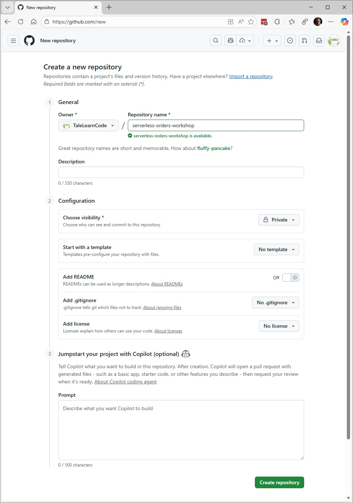
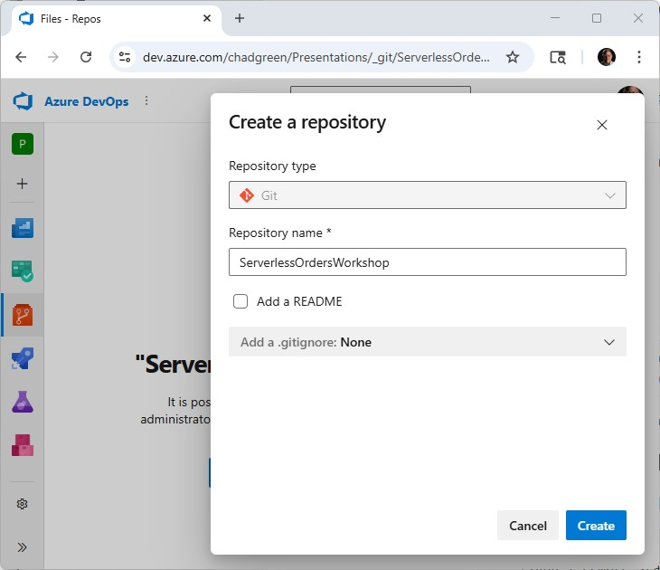

# Lab 0.0: Environment Setup

Before we begin provisioning infrastructure, we need to store our code and a local environment from which to work. In this lab,  you will create a GitHub or Azure DevOps repository (your choice), clone it to your local machine, and scaffold the folder structure we will use for Terraform projects throughout the workshop.

---

## Objectives

In this lab, you will:

- Create a new repository in GitHub or Azure DevOps.
- Clone the repository to your local machine.
- Create a folder structure for Terraform labs.
- Commit and push the initial structure.

By the end of this lab, you will have your centralized and remote repositories ready for use during the rest of the labs.

---

# Prerequisites

- GitHub account or Azure DevOps organization.

- Git client installed.
- Local development environment (Visual Studio Code recommended).

---

## Background Information

### How It Works

- **Repositories:** Store and version control your infrastructure code.
- **Local Clone:** A working copy of the repo on your machine where you will edit Terraform files.
- **Folder Structure:** Organizes labs and modules so each task is self-contained and easy to navigate.

### Key Characteristics

- GitHub and Azure DevOps both support Git-based workflows.
- Repositories can be public or private (for this workshop, private is fine).
- A consistent folder structure makes it easier to follow along and revisit later.

### Key Benefits

- **Version Control:** Track changes and roll back if needed.
- **Collaboration:** Pipelines and team members can share the same repo.
- **Reusability:** You can reuse this structure for future workshops or projects.

---

## Lab Steps

### Step 1: Create a Repository

Choose one of the following:

#### Option A: GitHub

1. Go to [GitHub](https://github.com).
2. Click **New Repository**.
3. Name it something like `serverless-orders-workshop`.
4. Select **Private** (or public).
5. Do not add a .gitignore file (we will add one locally).
6. Do not initialize with a README (we will add one locally).



#### Option B: Azure DevOps

1. Go to your Azure DevOps organization (https://dev.azure.com/{organization}).
2. Navigate to the appropriate Project and then to Repos.
3. Click **+ New repository**.
4. Name it something like `ServerlessOrdersWorkshop`.
5. Select **Private** (or public).
6. Do not initialize with a README (we will add one locally).
7. Do not add a .gitignore file (we will add one locally).
8. Click the **Create** button.



### Step 2: Clone the Repository Locally

From the terminal, run:

**GitHub Central Repository:**

```shell
git clone https://github.com/<your-username>/serverless-orders-workshop.git
cd serverless-orders-workshop
```

**Azure DevOps Central Repository:**

```
git clone https://<Organization>@dev.azure.com/chadgreen/Presentations/_git/ServerlessOrdersWorkshop
cd ServerlessOrdersWorkshop
```

> [!NOTE]
>
> You will get the following message from git, which is correct (there is nothing in our repository so far):
>
> ```shell
> warning: You appear to have cloned an empty repository.
> ```

### Step 3: Create Folder Structure

Create the `infra` folder:

```shell
md infra
cd infra
md remote-state
md serverless-orders
```

> [!NOTE]
>
> Create the empty folder; we will add Terraform configuration in later labs.

### Step 4: Add a .gitignore

Create a `.gitignore` file in the repository's root so we do not inadvertently push files we do not want to the central repository.

```shell
code .gitignore
```

Add the following to the file and save:

```
### Terraform ###
# Local .terraform directories
**/.terraform/*

# .tfstate files
*.tfstate
*.tfstate.*

# Crash log files
crash.log
crash.*.log

# Exclude all .tfvars files, which are likely to contain sensitive data, such as
# password, private keys, and other secrets. These should not be part of version
# control as they are data points which are potentially sensitive and subject
# to change depending on the environment.
*.tfvars
*.tfvars.json

# Ignore override files as they are usually used to override resources locally and so
# are not checked in
override.tf
override.tf.json
*_override.tf
*_override.tf.json

# Include override files you do wish to add to version control using negated pattern
# !example_override.tf

# Include tfplan files to ignore the plan output of command: terraform plan -out=tfplan
# example: *tfplan*

# Ignore CLI configuration files
.terraformrc
terraform.rc

### VisualStudioCode ###
.vscode/*
!.vscode/settings.json
!.vscode/tasks.json
!.vscode/launch.json
!.vscode/extensions.json
!.vscode/*.code-snippets

# Local History for Visual Studio Code
.history/

# Built Visual Studio Code Extensions
*.vsix

### VisualStudioCode Patch ###
# Ignore all local history of files
.history
.ionide

### VisualStudio ###
## Ignore Visual Studio temporary files, build results, and
## files generated by popular Visual Studio add-ons.
##
## Get latest from https://github.com/github/gitignore/blob/main/VisualStudio.gitignore

# User-specific files
*.rsuser
*.suo
*.user
*.userosscache
*.sln.docstates

# User-specific files (MonoDevelop/Xamarin Studio)
*.userprefs

# Mono auto generated files
mono_crash.*

# Build results
[Dd]ebug/
[Dd]ebugPublic/
[Rr]elease/
[Rr]eleases/
x64/
x86/
[Ww][Ii][Nn]32/
[Aa][Rr][Mm]/
[Aa][Rr][Mm]64/
bld/
[Bb]in/
[Oo]bj/
[Ll]og/
[Ll]ogs/

# Visual Studio 2015/2017 cache/options directory
.vs/
# Uncomment if you have tasks that create the project's static files in wwwroot
#wwwroot/

# Visual Studio 2017 auto generated files
Generated\ Files/

# MSTest test Results
[Tt]est[Rr]esult*/
[Bb]uild[Ll]og.*

# NUnit
*.VisualState.xml
TestResult.xml
nunit-*.xml

# Build Results of an ATL Project
[Dd]ebugPS/
[Rr]eleasePS/
dlldata.c

# Benchmark Results
BenchmarkDotNet.Artifacts/

# .NET Core
project.lock.json
project.fragment.lock.json
artifacts/

# ASP.NET Scaffolding
ScaffoldingReadMe.txt

# StyleCop
StyleCopReport.xml

# Files built by Visual Studio
*_i.c
*_p.c
*_h.h
*.ilk
*.meta
*.obj
*.iobj
*.pch
*.pdb
*.ipdb
*.pgc
*.pgd
*.rsp
*.sbr
*.tlb
*.tli
*.tlh
*.tmp
*.tmp_proj
*_wpftmp.csproj
*.log
*.tlog
*.vspscc
*.vssscc
.builds
*.pidb
*.svclog
*.scc

# Chutzpah Test files
_Chutzpah*

# Visual C++ cache files
ipch/
*.aps
*.ncb
*.opendb
*.opensdf
*.sdf
*.cachefile
*.VC.db
*.VC.VC.opendb

# Visual Studio profiler
*.psess
*.vsp
*.vspx
*.sap

# Visual Studio Trace Files
*.e2e

# TFS 2012 Local Workspace
$tf/

# Guidance Automation Toolkit
*.gpState

# ReSharper is a .NET coding add-in
_ReSharper*/
*.[Rr]e[Ss]harper
*.DotSettings.user

# TeamCity is a build add-in
_TeamCity*

# DotCover is a Code Coverage Tool
*.dotCover

# AxoCover is a Code Coverage Tool
.axoCover/*
!.axoCover/settings.json

# Coverlet is a free, cross platform Code Coverage Tool
coverage*.json
coverage*.xml
coverage*.info

# Visual Studio code coverage results
*.coverage
*.coveragexml

# NCrunch
_NCrunch_*
.*crunch*.local.xml
nCrunchTemp_*

# MightyMoose
*.mm.*
AutoTest.Net/

# Web workbench (sass)
.sass-cache/

# Installshield output folder
[Ee]xpress/

# DocProject is a documentation generator add-in
DocProject/buildhelp/
DocProject/Help/*.HxT
DocProject/Help/*.HxC
DocProject/Help/*.hhc
DocProject/Help/*.hhk
DocProject/Help/*.hhp
DocProject/Help/Html2
DocProject/Help/html

# Click-Once directory
publish/

# Publish Web Output
*.[Pp]ublish.xml
*.azurePubxml
# Note: Comment the next line if you want to checkin your web deploy settings,
# but database connection strings (with potential passwords) will be unencrypted
*.pubxml
*.publishproj

# Microsoft Azure Web App publish settings. Comment the next line if you want to
# checkin your Azure Web App publish settings, but sensitive information contained
# in these scripts will be unencrypted
PublishScripts/

# NuGet Packages
*.nupkg
# NuGet Symbol Packages
*.snupkg
# The packages folder can be ignored because of Package Restore
**/[Pp]ackages/*
# except build/, which is used as an MSBuild target.
!**/[Pp]ackages/build/
# Uncomment if necessary however generally it will be regenerated when needed
#!**/[Pp]ackages/repositories.config
# NuGet v3's project.json files produces more ignorable files
*.nuget.props
*.nuget.targets

# Microsoft Azure Build Output
csx/
*.build.csdef

# Microsoft Azure Emulator
ecf/
rcf/

# Windows Store app package directories and files
AppPackages/
BundleArtifacts/
Package.StoreAssociation.xml
_pkginfo.txt
*.appx
*.appxbundle
*.appxupload

# Visual Studio cache files
# files ending in .cache can be ignored
*.[Cc]ache
# but keep track of directories ending in .cache
!?*.[Cc]ache/

# Others
ClientBin/
~$*
*~
*.dbmdl
*.dbproj.schemaview
*.jfm
*.pfx
*.publishsettings
orleans.codegen.cs

# Including strong name files can present a security risk
# (https://github.com/github/gitignore/pull/2483#issue-259490424)
#*.snk

# Since there are multiple workflows, uncomment next line to ignore bower_components
# (https://github.com/github/gitignore/pull/1529#issuecomment-104372622)
#bower_components/

# RIA/Silverlight projects
Generated_Code/

# Backup & report files from converting an old project file
# to a newer Visual Studio version. Backup files are not needed,
# because we have git ;-)
_UpgradeReport_Files/
Backup*/
UpgradeLog*.XML
UpgradeLog*.htm
ServiceFabricBackup/
*.rptproj.bak

# SQL Server files
*.mdf
*.ldf
*.ndf

# Business Intelligence projects
*.rdl.data
*.bim.layout
*.bim_*.settings
*.rptproj.rsuser
*- [Bb]ackup.rdl
*- [Bb]ackup ([0-9]).rdl
*- [Bb]ackup ([0-9][0-9]).rdl

# Microsoft Fakes
FakesAssemblies/

# GhostDoc plugin setting file
*.GhostDoc.xml

# Node.js Tools for Visual Studio
.ntvs_analysis.dat
node_modules/

# Visual Studio 6 build log
*.plg

# Visual Studio 6 workspace options file
*.opt

# Visual Studio 6 auto-generated workspace file (contains which files were open etc.)
*.vbw

# Visual Studio 6 auto-generated project file (contains which files were open etc.)
*.vbp

# Visual Studio 6 workspace and project file (working project files containing files to include in project)
*.dsw
*.dsp

# Visual Studio 6 technical files

# Visual Studio LightSwitch build output
**/*.HTMLClient/GeneratedArtifacts
**/*.DesktopClient/GeneratedArtifacts
**/*.DesktopClient/ModelManifest.xml
**/*.Server/GeneratedArtifacts
**/*.Server/ModelManifest.xml
_Pvt_Extensions

# Paket dependency manager
.paket/paket.exe
paket-files/

# FAKE - F# Make
.fake/

# CodeRush personal settings
.cr/personal

# Python Tools for Visual Studio (PTVS)
__pycache__/
*.pyc

# Cake - Uncomment if you are using it
# tools/**
# !tools/packages.config

# Tabs Studio
*.tss

# Telerik's JustMock configuration file
*.jmconfig

# BizTalk build output
*.btp.cs
*.btm.cs
*.odx.cs
*.xsd.cs

# OpenCover UI analysis results
OpenCover/

# Azure Stream Analytics local run output
ASALocalRun/

# MSBuild Binary and Structured Log
*.binlog

# NVidia Nsight GPU debugger configuration file
*.nvuser

# MFractors (Xamarin productivity tool) working folder
.mfractor/

# Local History for Visual Studio
.localhistory/

# Visual Studio History (VSHistory) files
.vshistory/

# BeatPulse healthcheck temp database
healthchecksdb

# Backup folder for Package Reference Convert tool in Visual Studio 2017
MigrationBackup/

# Ionide (cross platform F# VS Code tools) working folder
.ionide/

# Fody - auto-generated XML schema
FodyWeavers.xsd

# VS Code files for those working on multiple tools
*.code-workspace

# Local History for Visual Studio Code

# Windows Installer files from build outputs
*.cab
*.msi
*.msix
*.msm
*.msp

# JetBrains Rider
*.sln.iml

### VisualStudio Patch ###
# Additional files built by Visual Studio
```

### Step 5: Add a README

Create a simple `README.md` at the repo root:

```markdown
# Serverless Orders Workshop

This repository contains infrastructure code and labs for the Serverless Order Processing & Tracking System workshop.
```

### Step 6: Commit the Push

```shell
git add .
git commit -m "Initial repo setup with infrastructure folder structure"
git push origin main
```

---

## Solution

The Solution folder contains a completed version of this lab, showing the expected folder structure and initial README.

```
/infra/
├── remote-state/
└── serverless-orders/
README.md
.gitignore
```

---

## Next Steps

You can start provisioning infrastructure with your repository and folder structure in place. In [**Lab 0.1: Remote State**](../Lab0.1-Remote-State/README.md) , you will use Terraform to create the backend resources for storing state.