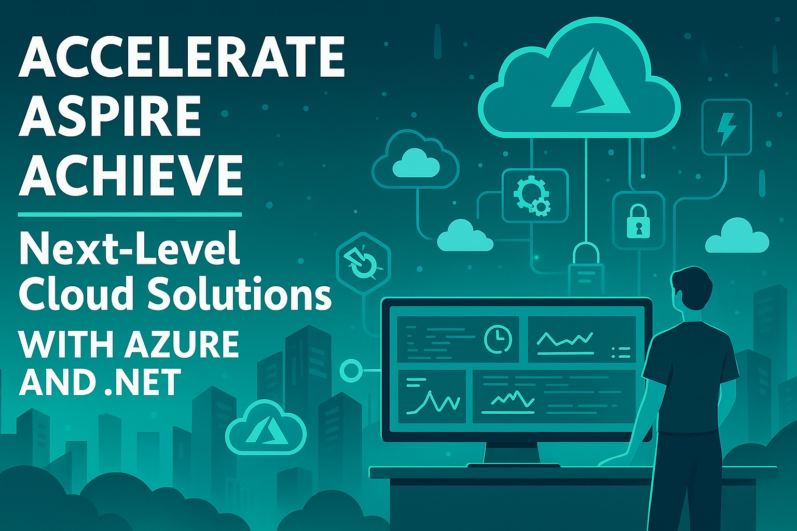

# Accelerate, Aspire, Achieve Next-Level Cloud Solutions with Azure and .NET

 🧑‍💻 Workshop 🔵 Intermediate

## Elevator Pitch

From Functions to Container Apps, learn how to design, deploy, and scale production‑ready serverless solutions on Azure with .NET. Hands‑on labs and real‑world patterns will accelerate your skills and help you build resilient, cost‑efficient cloud architectures.

## Abstract

Immerse yourself in a full‑day interactive workshop that empowers you to harness the true potential of serverless computing on Azure using .NET. Designed for innovative developers and forward‑thinking architects, this session blends in‑depth theory with hands‑on labs that walk you through architecting, developing, and deploying production‑grade serverless applications.

You’ll explore Azure Functions, Container Apps, Service Bus, Cosmos DB, Key Vault, App Configuration, and CI/CD pipelines—learning how these services work together to create scalable, resilient, and cost‑efficient solutions. With this experience, you’ll accelerate your development, aspire to develop groundbreaking cloud architectures, and achieve the skills to drive digital innovation in your organization.

# Type

- Full‑day workshop (adaptable to 45/60/75‑minute sessions)

## Tags

​          

## Learning Objectives

- Master end‑to‑end serverless development on Azure with .NET, from concept to deployment.
- Gain hands‑on experience through labs simulating real‑world production scenarios.
- Learn best scalability, observability, and cost optimization practices in cloud‑native systems.
- Understand trade‑offs between Azure services (Functions, Container Apps, Cosmos DB, etc.) and when to use each.
- Build confidence in applying infrastructure, such as code and CI/CD pipelines, to deliver resilient solutions.

## Prerequisites

- **Intermediate .NET and Azure Knowledge:** Familiarity with C#, Azure basics, and Git workflows.
- **Hands‑On Readiness:** Bring a laptop installed with Visual Studio Code, .NET SDK, and Azure CLI.
- **Curiosity to Explore:** Be ready to experiment, troubleshoot, and learn through guided labs.

## Presentations

| Event                                                        | Location    | Date       | Time      | Room | Downloads            |
| ------------------------------------------------------------ | ----------- | ---------- | --------- | ---- | -------------------- |
| [Live! 360](https://live360events.com/events/orlando-2025/sessions/sunday/cchol01-cloud-solutions.aspx) | Orlando, FL | 2025-11-16 | 09:00 EST | TBA  | Available Afterwards |

## Resources

There are no additional resources for this presentation.

Email [chadgreen@chadgreen.com](mailto:chadgreen@chadgreen.com?subject=Accelerate,%20Aspire,%Achieve) to have Chad present this workshop at your event.